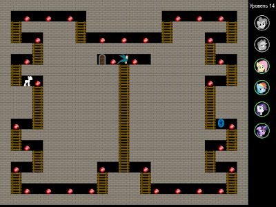
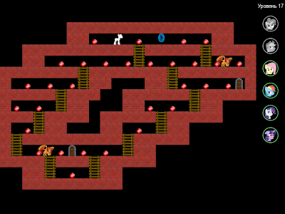

Игра "Пони собирает рубины", вариация Пакмена с героями MLP:FiM и дополнительными механиками  
The game "Pony collect rubies", Pacman-styled gameplay with MLP:FiM heroes and additional features

## О проекте

Задача игры - управляя пони в лабиринте, собрать все рубины на карте и 
проследовать к порталу-выходу. Необходимо избегать столкновений с монстрами.
Игроку доступны способности шестерки геров, заданных при старте карты
или добытых в лабиринте.

 

Проект разработан на языке ObjectPascal, в качестве графической библиотеки
используется [SFML](https://www.sfml-dev.org), в качестве игрового движка -
проект [PascalGameEngine](https://github.com/tereshenkovav/PascalGameEngine).
Версия для Windows может быть собрана как при помощи Delphi,
так и при помощи [FreePascalCompiler](https://www.freepascal.org). Версия для Linux собирается
только через FreePascalCompiler.

## Состав репозитория

* `build` - cкрипты сборки игры с использованием FreePascalCompiler
* `data` - каталог контента игры (графика, звуки, тексты, уровни)
* `graphics` - иконки игры для дистрибутива и AppImage
* `PascalGameEngine` - субмодуль движка PascalGameEngine
* `setup` - скрипты создания дистрибутивов/архивов для Windows, и AppImage для Linux
* `src` - исходный код игры в виде проектов для Delphi и FreePascalCompiler.

## Инструменты сборки

Для сборки проекта нужен либо установленный
[Delphi](https://delphi.embarcadero.com/)
(проверено с версиями 10 и 11),
либо [FreePascalCompiler](https://www.freepascal.org)
(проверено с версией 3.0.4)

Создание дистрибутива для Windows выполняется с помощью программы
[NSIS](https://nsis.sourceforge.io)

Создание архива для Windows выполняется с помощью консольной версии архиватора 
[7-Zip](https://www.7-zip.org)

Для создания AppImage под Linux необходим инструмент сборки AppImageKit - 
[appimagetool-x86_64.AppImage](https://github.com/AppImage/AppImageKit/releases)

## Сборка, запуск игры и создание дистрибутивов

### Сборка

После получения файлов репозитория, нужно обновить субмодуль движка `PascalGameEngine`,
выполнив в каталоге проекта команды

```
git submodule init
git submodule update

```

Для сборки проекта в Windows при помощи Delphi нужно открыть проект
`src\PonyRubyGrabberDelphi.dproj` и выполнить его сборку в конфигурации Release.
В каталоге bin появится исполняемый файл `PonyRubyGrabberDelphi.exe`.

Для сборки проекта в Windows при помощи FreePascal нужно открыть каталог
`build` и запустить файл `make_win32.bat`
В каталоге bin появится исполняемый файл `PonyRubyGrabberFPC.exe`.

Для сборки проекта в Linux при помощи FreePascal нужно открыть каталог
`build` и запустить файл `make_linux64.sh`
В каталоге bin появится исполняемый файл `PonyRubyGrabberFPC`.
Чтобы выполнить сборку и запуск проекта, понадобятся установленные
библиотеки `sfml` и `csfml`.

### Запуск

Чтобы запустить версию для Windows, вне зависимости от способа сборки,
нужно скопировать в каталог `bin` файлы субмодуля движка
из каталога `PascalGameEngine\csfml\win32`

* `csfml-audio-2.dll`
* `csfml-graphics-2.dll`
* `csfml-system-2.dll`
* `csfml-window-2.dll`
* `openal32.dll`

### Создание дистрибутивов

**ВАЖНО**: при создании дистрибутивов, информация о версии, ветке и коммите берется
из репозитория git, поэтому все описанные ниже команды будут работать корректно
только при вызове из каталога-репозитория git и при наличии установленного git.

Создание архива и дистрибутива для Windows выполняется 
после сборки проекта запуском файла `build32.bat` 
из каталога `setup/windows`\
В файле сборки нужно указать путь к компилятору NSIS.\
В первой строке файла сборки нужно указать, какой исполнимый файл будет включен
в дистрибутив - `PonyRubyGrabberDelphi.exe` или `PonyRubyGrabberFPC.exe`\

Создание AppImage для Linux выполняется 
после сборки проекта запуском файла `build64.sh`
из каталога `setup/linux`. В каталоге `/tmp`
появятся готовые образы AppImage для 64-битной версии Linux.
